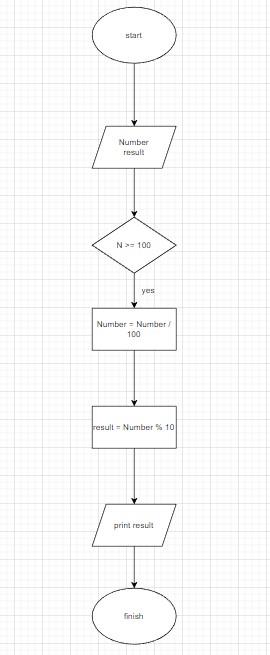
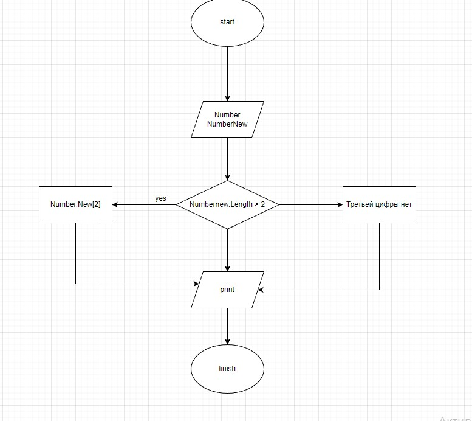
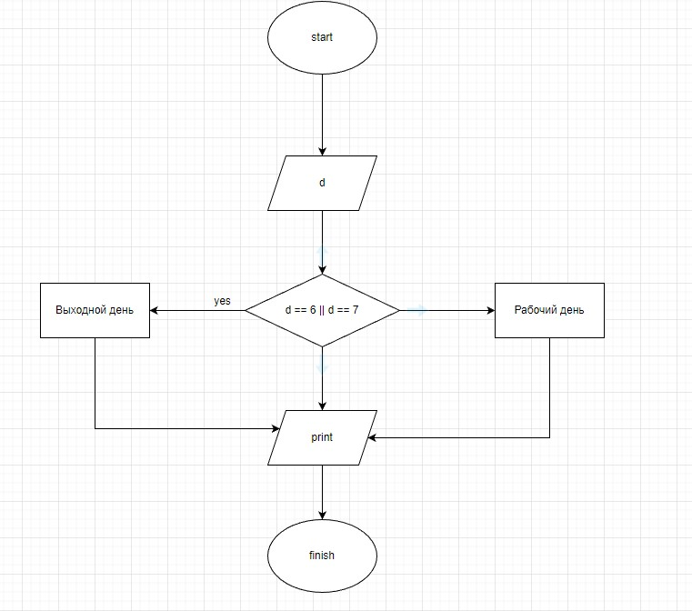

# ЗАДАЧА 1

## Напишите программу, которая принимает на вход трёхзначное число и на выходе показывает вторую цифру этого числа.

**Блок-схема**

**[Код](task_1/Program.cs)**

# ЗАДАЧА 2

## Напишите программу, которая выводит третью цифру заданного числа или сообщает, что третьей цифры нет.

**Блок-схема**

**[Код](task_2/Program.cs)**

# ЗАДАЧА 3

## Напишите программу, которая принимает на вход цифру, обозначающую день недели, и проверяет, является ли этот день выходным.

**[Код](task_3/Program.cs)**